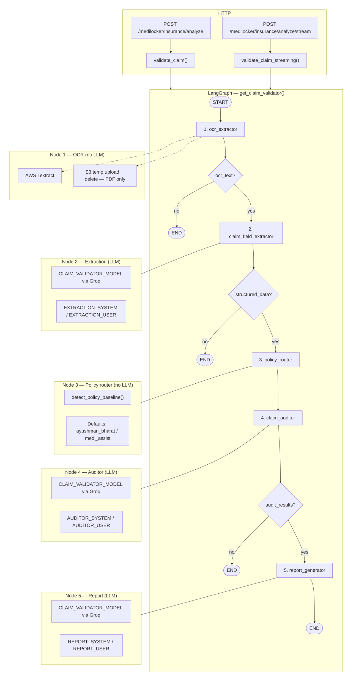

```mermaid
%%{init: {
  'themeVariables': { 
    'fontSize': '20px'
  },
  'flowchart': {
    'nodeSpacing': 50,
    'rankSpacing': 60,
    'diagramPadding': 40
  }
}}%%

flowchart TB
    subgraph API["HTTP"]
        H["POST /medilocker/insurance/analyze"]
        HS["POST /medilocker/insurance/analyze/stream"]
        H --> V["validate_claim()"]
        HS --> VS["validate_claim_streaming()"]
    end

    subgraph Graph["LangGraph — get_claim_validator()"]
        START([START]) --> N1["1. ocr_extractor"]

        N1 --> G1{ocr_text?}
        G1 -->|no| END1([END])
        G1 -->|yes| N2["2. claim_field_extractor"]

        N2 --> G2{structured_data?}
        G2 -->|no| END2([END])
        G2 -->|yes| N3["3. policy_router"]

        N3 --> N4["4. claim_auditor"]

        N4 --> G3{audit_results?}
        G3 -->|no| END3([END])
        G3 -->|yes| N5["5. report_generator"]

        N5 --> END4([END])
    end

    V --> Graph
    VS --> Graph

    subgraph N1detail["Node 1 — OCR (no LLM)"]
        T1["AWS Textract"]
        S3temp["S3 temp upload + delete — PDF only"]
        N1 -.-> T1
        N1 -.-> S3temp
    end

    subgraph N2detail["Node 2 — Extraction (LLM)"]
        M2["CLAIM_VALIDATOR_MODEL via Groq"]
        P2["EXTRACTION_SYSTEM / EXTRACTION_USER"]
    end

    subgraph N3detail["Node 3 — Policy router (no LLM)"]
        PR["detect_policy_baseline()"]
        DEF["Defaults: ayushman_bharat / medi_assist"]
    end

    subgraph N4detail["Node 4 — Auditor (LLM)"]
        M4["CLAIM_VALIDATOR_MODEL via Groq"]
        P4["AUDITOR_SYSTEM / AUDITOR_USER"]
    end

    subgraph N5detail["Node 5 — Report (LLM)"]
        M5["CLAIM_VALIDATOR_MODEL via Groq"]
        P5["REPORT_SYSTEM / REPORT_USER"]
    end

    N2 --- N2detail
    N3 --- N3detail
    N4 --- N4detail
    N5 --- N5detail
```
