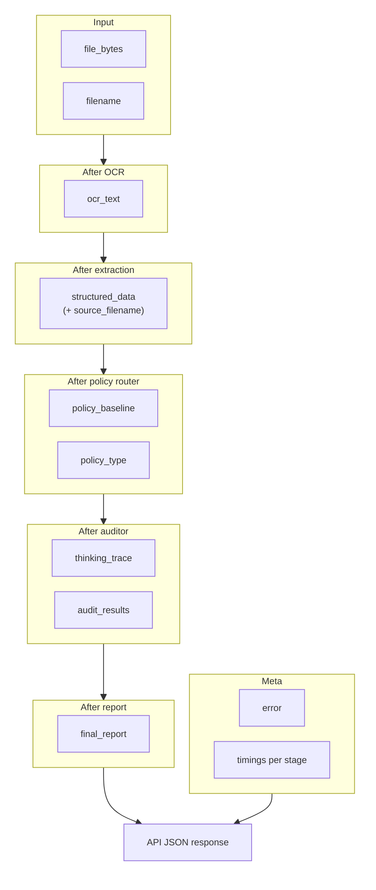

```mermaid
%%{init: {
  'themeVariables': { 
    'fontSize': '12px'
  },
  'flowchart': {
    'nodeSpacing': 20,
    'rankSpacing': 40,
    'diagramPadding': 20
  }
}}%%

flowchart TD
    subgraph In["Input"]
        FB["file_bytes"]
        FN["filename"]
    end

    subgraph S1["After OCR"]
        OT["ocr_text"]
    end

    subgraph S2["After extraction"]
        SD["structured_data\n(+ source_filename)"]
    end

    subgraph S3["After policy router"]
        PB["policy_baseline"]
        PT["policy_type"]
    end

    subgraph S4["After auditor"]
        TT["thinking_trace"]
        AR["audit_results"]
    end

    subgraph S5["After report"]
        FR["final_report"]
    end

    subgraph Meta["Meta"]
        ER["error"]
        TM["timings per stage"]
    end

    In --> S1 --> S2 --> S3 --> S4 --> S5
    S5 --> Out["API JSON response"]
    Meta --> Out
```
