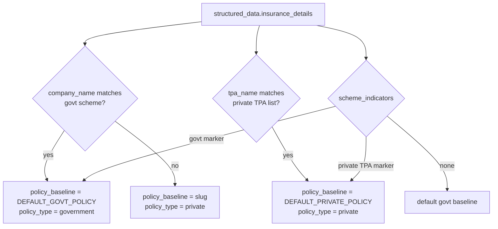

```mermaid
flowchart TD
    I["structured_data.insurance_details"] --> C{company_name matches\ngovt scheme?}
    C -->|yes| G["policy_baseline = DEFAULT_GOVT_POLICY\npolicy_type = government"]
    C -->|no| P["policy_baseline = slug\npolicy_type = private"]
    I --> T{tpa_name matches\nprivate TPA list?}
    T -->|yes| MP["policy_baseline = DEFAULT_PRIVATE_POLICY\npolicy_type = private"]
    I --> S{scheme_indicators}
    S -->|govt marker| G
    S -->|private TPA marker| MP
    S -->|none| F["default govt baseline"]
```
